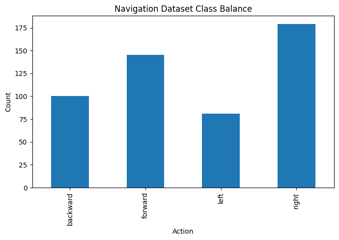
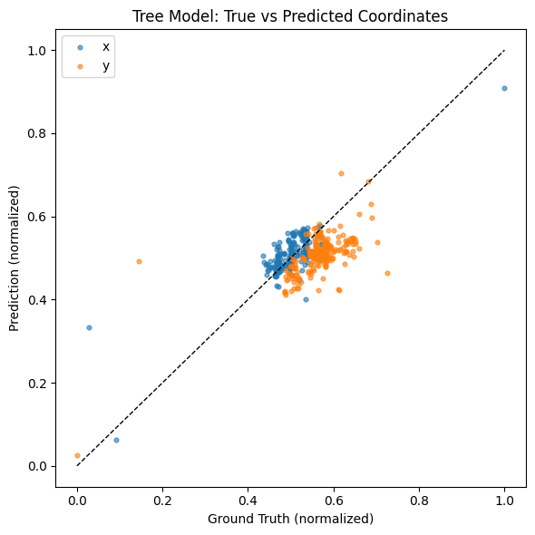
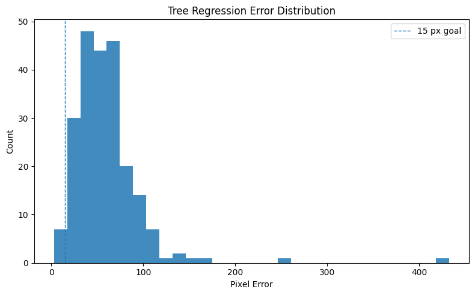
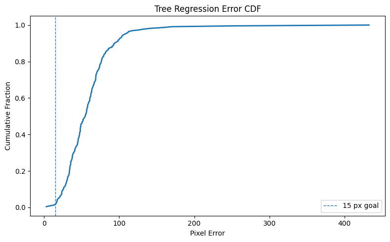
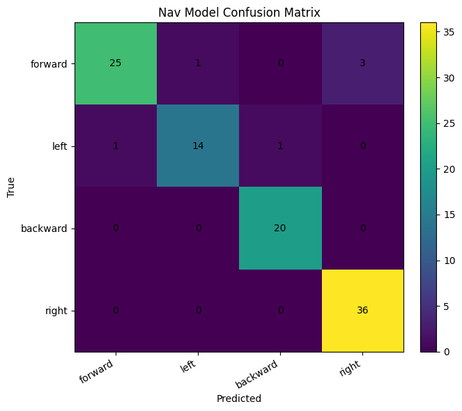

# Semi-Autonomous Agent in Stein.world

**McKayla Ashley & Anya Anand**  
*Artificial Neural Networks and Deep Learning — Spring 2026*

> We wanted to explore if it was possible for a neural network to learn gameplay behavior from direct observation. Instead of manually programming exact coordinates of trees, we collected 1.5+ images that demonstrated gameplay that ranged from two primary tasks: 1) where to click to harvest trees and 2) navigating alongside a path. Our final result was a semi-autonomous agent capable of navigating through a path and harvesting resources.

---

## Introduction and problem statement

Historically, automating interactions within MORPGs (multiplayer online role-playing games) have relied on two methods that bypass actual intelligence: 
- Memory Manipulation: Directly reading the game's RAM to find object coordinates 
- Heuristic Scripting: Using rigid "If-Then" logic (EX, If pixel color at (x, y) is Green, then click) 
However, these methods are fragile. If the lighting changes, the player moves to a new biome, or an anti-cheat system is implemented, the bot breaks. They do not simulate how a human actually sees and interprets a game.

We wanted to explore whether a CNN could learn actual useful gameplay simply from imputed screenshots of real human play. Rather than hardcoding exact interactive rules, the project approached playing the game as a supervised learning problem. We used the following pipeline of capturing screenshots during human gameplay, recording actions associated with the screenshots, and training a neural network to imitate those actions. We focus on two essential connected tasks:
1. Predicting where a player would click from a screenshot in order to hit a tree
2. Predicting movement directions from gameplay frames
We then combined these components into a live inference system that was capable of navigating and harvesting trees semi autonomously.

### Research question

> **Can a lightweight CNN learn useful gameplay behavior purely from observing human interaction?**
From this we divided into 2 separate machine learning tasks.

#### Click Prediction
We first were challenged with understanding spatial regression of the model. The model receives a screenshot of the game as input and predicts two continuous values representing the normalized screen coordinates of the next mouse click. These coordinates represent where an actual human player would likely click in order to interact with a nearby tree. Instead of explicitly identifying trees through object detection, the model attempts to infer visually meaningful interactions areas through imitation.

#### Navigation Prediction
In order to achieve a semi-autonomous gameplay, the agent also had to understand how to move around the game. A second model was also used to predict directional movement using gameplay recordings. This transformed the problem into a four class classification problem: forwards, left, backwards, right. 

---

## Methodology and data
The project uses a machine learning approach that imitates learning demonstrated by a human training set. Instead of manually defining gameplay, we connected examples of our own gameplay. For this process, we first started with screenshotting a datapoint every time we clicked on a tree to chop it, in this way the system recorded both the actual image and the action being performed. We hypothesized that if we collected enough samples when chopping down the trees, the neural network may begin to associate certain visual patterns with likely player actions!

### High-level design

We treated gameplay as two supervised tasks:

| Task | Input | Output | Loss |
|------|--------|--------|------|
| **Harvesting (click)** | RGB image (resized to 224×224) | Two numbers in \([0,1]\): normalized click \(x, y\) | Mean squared error (MSE) |
| **Navigation** | RGB image (224×224) | One of four classes: forward / left / backward / right | Cross-entropy |

### Data we collected

#### 1. Click / harvest dataset (`data_collection.py`)

- Run the script, press `s` to start recording.
- Every click saves a full-screen screenshot under `training_data/`.
- The filename encodes the click position, e.g. `target_<x>_<y>_<id>.png`, with coordinates adjusted for scaling so they match the saved image pixels.

After preprocessing (below), our master label file `labels.csv` aligns ~1,114 labeled click examples with resized images in `processed_data/`.

*Limitation:* most early harvesting demos focused on one tree type and similar terrain because character progression limited where we could record consistently.

#### 2. Navigation dataset (`path_data_collection.py`)

- Press `r` to toggle recording.
- While recording, each W / A / S / D or arrow key* press saves a frame to `path_training_data/` and appends a row to `path_labels.csv` (filename, action label, timestamp).

We collected ~500 directional frames. Class balance reflects *where we walked.

**Figure 1 — Navigation class balance**  
  
**Caption:** Distribution of movement labels in our path dataset. Skew toward *right* reflects the specific route we took (e.g. Farshore-style paths), not universal game statistics.

### Preprocessing (`preprocess.py`, `path_preprocess.py`)

**Clicking Task:**

- Resize images to 224×224 (model input).
- Normalize labels to [0, 1] by dividing click coordinates by each image’s true width and height 
- Emit `labels.csv`: columns `filename`, `x`, `y`.

**Navigation Task:**

- Filter unknown actions, verify files exist, map strings to class IDs `0–3`.
- Write cleaned splits under `path_processed/` (`path_labels_train.csv`, `path_labels_val.csv`, plus full merge).

### Neural networks and training (`train.py`, `path_train.py`)

**Shared backbone:** **ResNet-18** from `torchvision`, pretrained on ImageNet.

- **Click model:** replace the final classification layer with a **linear layer with 2 outputs**. Train with **Adam** (learning rate `1e-3`), **batch size 32**, **10 epochs**, **80/20 train–validation split** (`random_state=42`). Save full model to `weights/stein_net_best.pth`.
- **Navigation model:** replace the head with **4 logits**. Train with **cross-entropy**; save best checkpoint plus metadata (class map, state dict) to `weights/path_nav_net_best.pth`.

**Why MSE for clicks?** It penalizes large pixel errors more than small ones—reasonable for regression. **Why cross-entropy for movement?** Standard choice for multi-class classification.

### Live agent (`agent.py`)

1. **Capture** a region of the screen with `mss`.
2. **Preprocess** the same way as training (resize, ImageNet normalization).
3. **Run inference** on GPU if available (CUDA on NVIDIA PCs; **MPS** on Apple Silicon Macs).
4. **Act** with `pyautogui` (mouse) and key taps derived from navigation predictions.

**State machine:** **`NAVIGATE`** vs **`CHOP`**. Roughly: move along the path until a plausible tree target appears stable near the character, then switch to clicking; if the target is lost for too long, return to navigation.

**Controls:** Press `s`* to start the loop after launching; `q` to quit. macOS needs Screen Recording and Accessibility permissions for capture and clicks.

### Resources needed to reproduce
- Hardware: A Mac or PC capable of running PyTorch; GPU/MPS speeds training and inference but CPU works for small models.
- *Game: Steinworld in the browser, windowed consistently with how you recorded data.
---

## Results

### Click prediction

The click prediction model successfully learned to identify plausible harvesting targets from gameplay screenshots.
Qualitatively, the model often focused on:
- nearby tree clusters
- visually distinct environmental regions
- interactable objects near the player

**Figure 2 — Predicted vs. true coordinates**  

**Caption:** Predicted coordinates cluster near the identity line, indicating strong agreement between human and model click locations. The model occasionally regresses toward center-biased predictions when uncertain.

**Figure 3 — Pixel error histogram**  

**Caption:** Euclidean distance between predicted and expert clicks after mapping back to screen pixels. Most errors land in a moderate band; a tail of larger errors corresponds to unusual frames (UI open, rare angles, objects not seen in training).

**Figure 4 — Cumulative distribution of error (CDF)**  

**Caption:** Most click predictions fall within a moderate pixel error range. While the model often exceeds our original 15-pixel target, many predictions still succeed because in-game harvesting hitboxes are substantially larger than a single pixel.

Even without explicit object detection, the network learned useful visual associations through imitation learning. In many cases, predictions landed very close to expert click locations and produced believable gameplay behavior.

### Navigation

**Figure 5 — Confusion matrix**  

**Caption:** The model shows exceptional performance on "right" movement (100% accuracy). The minor leakage between the others suggests some visual similarity in the pathing textures in those specific directions.

### Video demos

1. **Harvesting** — Agent identifies a target and performs repeated interactions.
<video width="100%" autoplay loop muted playsinline>
  <source src="blog_figures/harvesting.mp4" type="video/mp4">
  Your browser does not support the video tag.
</video>

2. **Path following** — Direction classifier plus heuristic steering along visible dirt/stone.
<video width="100%" autoplay loop muted playsinline>
  <source src="blog_figures/path_following.mp4" type="video/mp4">
  Your browser does not support the video tag.
</video>

3. **Alternate region** — Behavior outside the tightest training distribution.
<video width="100%" autoplay loop muted playsinline>
  <source src="blog_figures/good_behavior.mp4" type="video/mp4">
  Your browser does not support the video tag.
</video>

4. **Failure case (wasp)** — Model imitates “swing near a tree” visuals and hits wrong object.
<video width="100%" autoplay loop muted playsinline>
  <source src="blog_figures/wasp_failure.mp4" type="video/mp4">
  Your browser does not support the video tag.
</video>

---

## Discussion

One of the most interesting findings from the project was how effectively relatively small convolutional neural networks could learn meaningful gameplay behavior from limited demonstration data. Without any explicit object detection or semantic understanding, the click prediction model often learned to identify visually relevant harvesting regions simply through repeated examples. At the same time, the project exposed several important limitations of imitation learning systems.

Looking at Figure 2, we see a dense cluster of predictions. This highlights a classic behavioral cloning challenge: the model learns the "average" of the expert's behavior. If I usually click near the center of the screen to harvest, the model becomes hesitant to predict clicks near the extreme edges of the browser window.

Additionally, Figure 4 shows that our "15px goal" was highly ambitious. In practice, the agent is still successful because game objects are larger than 15 pixels. This demonstrates a key takeaway: The required precision of a model is defined by the environment's tolerance.

### Challenges and mitigations

| Challenge | What happened | Mitigation |
|-----------|----------------|------------|
| **Retina / coordinate mismatch** | Labels looked valid but were “off” in normalized space; model saturated corners. | Normalize \(x,y\) by **actual image width/height** in `preprocess.py`. |
| **Jittery clicks** | Cursor jumped frame-to-frame. | Temporal smoothing, dead-zones, “stable for N frames” before clicking. |
| **Shrubs vs. trees** | Greenery everywhere; regression chases the wrong clump. | Local search near player + simple color / structure heuristics + later data diversity. |
| **Distribution shift** | New biome or UI → worse predictions. | Acknowledge limits; collect broader data or add detection stages. |
| **Long-horizon autonomy** | Small navigation errors compound; rare hostile clicks. | Keep human supervision; future work could add explicit state (health bar, target nameplate) or RL fine-tuning. |

---

## Conclusion

Our project explored whether a lightweight vision model could learn gameplay behavior directly from human demonstrations. Using behavioral cloning and convolutional neural networks, the system learned to:
- predict click locations from screenshots
- estimate movement directions
- execute a semi-autonomous harvesting loop

Although the agent remains imperfect, the project demonstrates how surprisingly far simple imitation learning techniques can go in visually structured environments. The project also highlighted the challenges involved in deploying machine learning systems in real-time interactive settings, particularly when predictions must remain stable over long sequences of actions.

**Future work:** larger and more diverse datasets; explicit object detection or segmentation; reading on-screen **target nameplates** if the game exposes them; reinforcement learning or human-in-the-loop correction; safer navigation with map-like memory.

More broadly, SteinNet demonstrates how machine learning can transform interaction problems traditionally solved through rigid scripting into adaptive, data-driven systems.

---

## Links and reproducibility checklist
---

## Appendix: repository map

| Artifact | Role |
|----------|------|
| `data_collection.py` | Record clicks → `training_data/`. |
| `preprocess.py` | Resize, normalize labels → `processed_data/`, `labels.csv`. |
| `train.py` | Train click regressor → `weights/stein_net_best.pth`. |
| `path_data_collection.py` | Record movement → `path_training_data/`, `path_labels.csv`. |
| `path_preprocess.py` | Clean / split nav labels → `path_processed/*.csv`. |
| `path_train.py` | Train nav classifier → `weights/path_nav_net_best.pth`. |
| `agent.py` | Live capture + inference + keyboard/mouse control. |
| `performance_analysis.ipynb` | Figures and quantitative summaries for this post. |
| `count.py` | Quick image counts under `path_training_data/`. |

---
